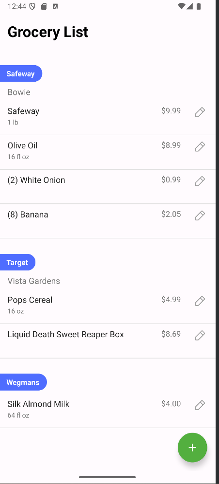
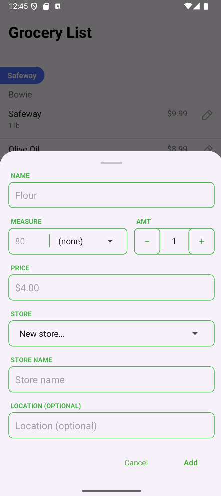
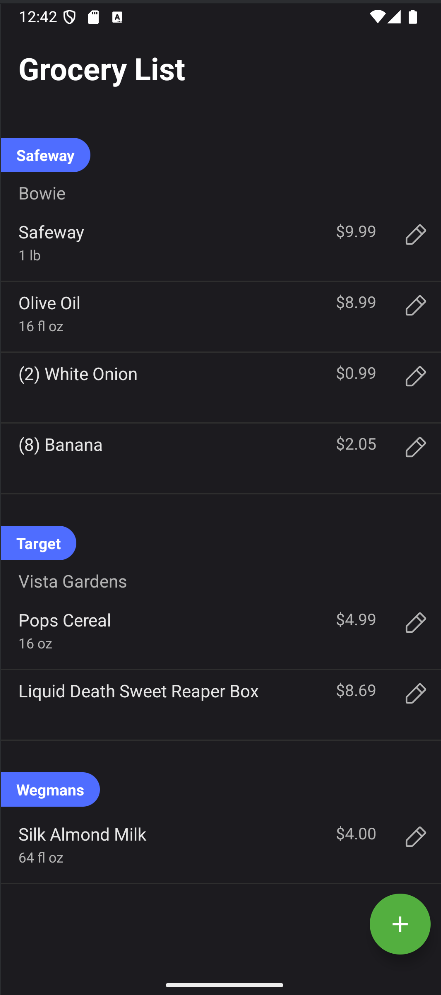
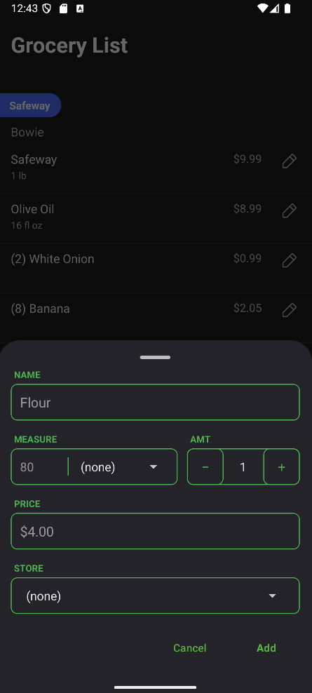

  

<h1 align="center">Cubbards</h1>

  Track your pantry, manage grocery lists, and understand price trends — all in one local-first Android app.

## Overview

Cubbards is a local-first Android application for managing pantry inventory, grocery lists, and price tracking.

The project was developed in structured milestones, focusing on normalized database design and reliable UI synchronization using Room (SQLite).

## Tech Stack

**Language & Platform**
- Java 17
- Android SDK

**Persistence**
- Room (SQLite)
- Versioned schema migrations (v1 → v13)

**UI**
- RecyclerView
- Material Components
- BottomSheetDialogFragment

**Architecture**
- DAO pattern
- Layered data access via DatabaseProvider

**Tooling**
- Android Studio
- Gradle

## Architecture Overview

- **Room (SQLite) Persistence:** Data is stored locally using Room with `@Entity` tables and `@Dao` queries.
- **Database Initialization:** `DatabaseProvider` exposes a single `AppDatabase` instance and applies schema migrations (v1 → v13).
- **UI Rendering:** Screens are built with RecyclerView-based lists. Add/Edit actions use BottomSheetDialogFragment flows that write changes through the DAO layer.

## Data Model

Cubbards is built around a normalized local database (Room/SQLite) to support pantry inventory, grocery list tracking, and price history.

Core tables include:
- **Ingredient**: canonical item names used across the app
- **PantryItem**: what the user currently has on hand (ingredient + quantity/state)
- **GroceryListItem**: items the user intends to buy (ingredient + status)
- **Store** / **StoreLocation**: where purchases are associated (optional per item)
- **PriceObservation**: historical price entries tied to an ingredient and store/location when available

## Milestone Development

Cubbards was developed iteratively using milestone-based releases. Each milestone expanded the data model while validating persistence behavior, 
relational integrity, and UI-state synchronization.

---

### Milestone 1 – Core Data Persistence

**Goal:** Establish a reliable Room database foundation.

**Implemented:**
- Room database configuration
- Entity and DAO setup
- Normalized relational schema design
- Versioned migrations
- CRUD validation testing

**Exit Criteria:**
- Data persists across app restarts
- No destructive migrations
- CRUD operations verified against Room
- Application launches successfully after schema upgrades

---

### Milestone 2 – Pantry Data Validation

**Goal:** Validate pantry-related data modeling and persistence behavior.

**Implemented:**
- `PantryItem` entity
- Quantity field modeling
- DAO operations for pantry records
- Manual validation using controlled test entries

**Exit Criteria:**
- Pantry records insert, update, and delete correctly
- Quantity values persist accurately across restarts
- Schema changes do not corrupt pantry data
- No orphaned records introduced during operations

> Note: Full pantry management UI is planned for a future milestone.

---

### Milestone 3 – Grocery List Integration

**Goal:** Introduce structured grocery list tracking with relational consistency.

**Implemented:**
- `GroceryListItem` entity
- Completion toggle persisted through Room
- Separation between pantry and grocery tables
- Store relationship modeling with foreign keys

**Exit Criteria:**
- Completion toggle persists to Room and survives app restarts
- Foreign key relationships preserved across inserts and updates
- No invalid or orphaned records created
- RecyclerView reflects database state accurately after updates

---

### Milestone 4 – Editing & UI Stability

**Goal:** Improve editing workflows while ensuring UI-state consistency and migration stability.

**Implemented:**
- Price and quantity editing flows
- Store location support
- Bottom sheet-based input system
- Delete handling with proper RecyclerView rebinding
- Night mode styling

**Exit Criteria:**
- Edits persist to Room and reflect immediately in RecyclerView
- Delete operations remove records without UI–database desynchronization
- Bottom sheet save and cancel flows validated against accidental state commits
- RecyclerView updates verified under rapid interaction
- No crashes observed during edit/delete edge cases
- Layout consistency maintained across light and dark themes
- Referential integrity preserved across schema upgrades

---

### Upcoming Milestones

- Pantry management UI
- Automatic category detection
- Price history analytics
- Accessibility refinements
- Adding spanish as a supported language

## Prototype & Planning

Initial workflows and UI state variations were explored in a structured prototype before implementation.

[View Full Design Board](https://www.figma.com/design/99gPA1rNjd5IUlfLdTLntv/cubbards-mid-fid?node-id=0-1&p=f&t=hICkCrAjPFlLozD4-0)

## Screenshots

### Light Theme – Grocery List

### Light Theme – Bottom Sheet

### Dark Mode – Grocery List

### Dark Mode – Bottom Sheet

## How to Run

1. Clone the repository:
git clone https://github.com/cVasquezRR413/Cubbards.git

2. Open the project in Android Studio.

3. Allow Gradle to sync dependencies.

4. Build and run on an emulator or physical Android device.

## Acknowledgements

Wireframe templates were adapted from graphic designer Al Ramirez.

## License
All rights reserved. No use, copying, or distribution without permission.
